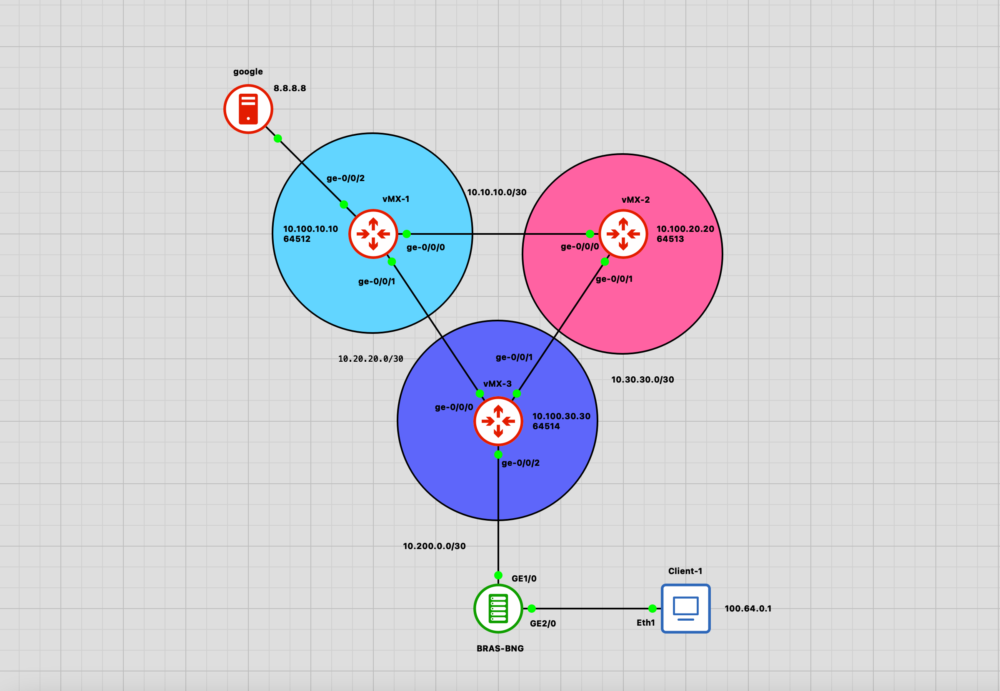
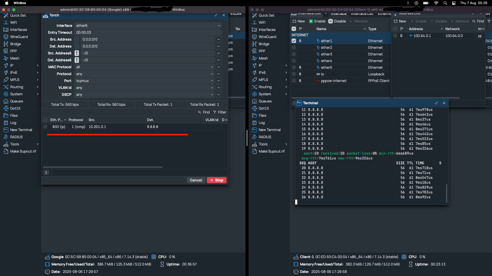
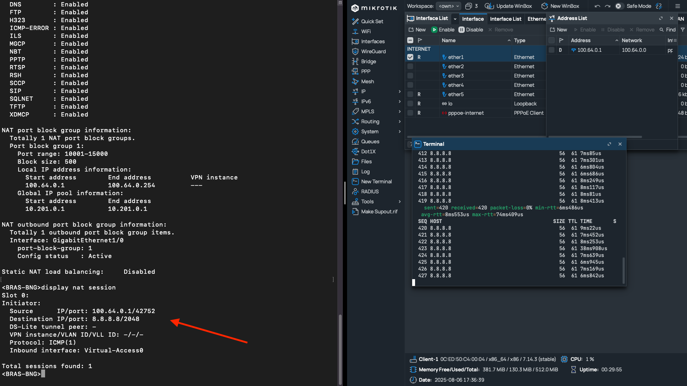
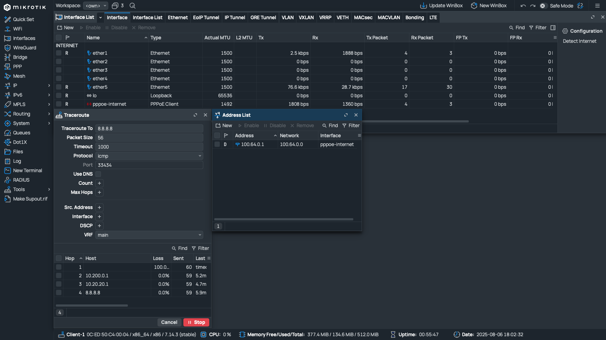
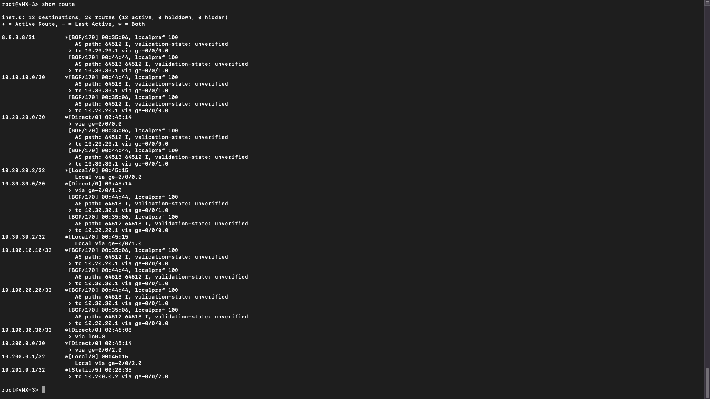

# H3C BRAS-BNG

## Topology & Documentation

### Images

#### Topology Overview

#### Client Ping and 8.8.8.8 Torch Results

#### NAT Session Display on BRAS-BNG During Client Ping

#### Client Trace Route

#### Routing Table on vMX-3

---

## Devices

- **BRAS-BNG**: H3C vBRAS1000  
- **BGP Router**: Juniper vMX-v14.1R1.10  
- **Client and 8.8.8.8**: MikroTik RouterOS 7.14.3  

---

## Documentation Link

[https://github.com/andre4freelance/gns3/tree/main/H3C-vBRAS-BRAS-BNG](https://github.com/andre4freelance/gns3/tree/main/H3C-vBRAS-BRAS-BNG)