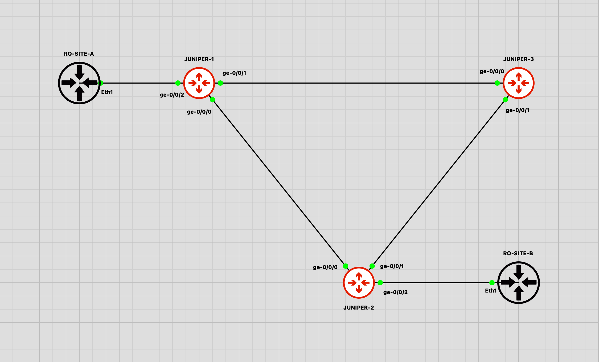
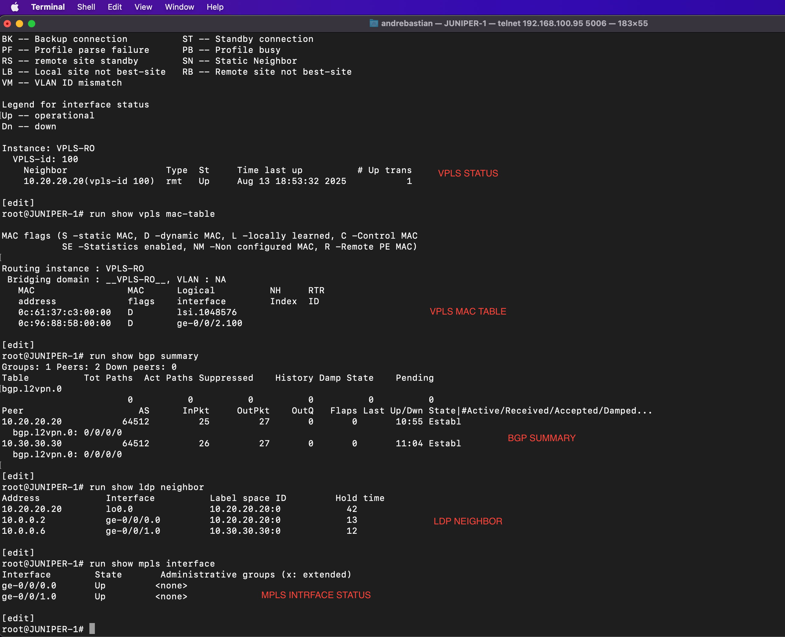

# JUNIPER VPLS

## Topology & Documentation

### Images

#### Topology Overview

#### VPLS, BGP, MPLS, and LDP Status

#### PING from RO-SITE-A to RO-SITE-B

---

## Devices

- **BRAS-BNG**: H3C vBRAS1000  
- **BGP Router**: Juniper vMX-v14.1R1.10  
- **Client and 8.8.8.8**: MikroTik RouterOS 7.14.3  

---

## Link

[https://github.com/andre4freelance/gns3/tree/main/H3C-vBRAS-BRAS-BNG](https://github.com/andre4freelance/gns3/tree/main/H3C-vBRAS-BRAS-BNG)